# Service & Sales Appliance Repair

A clean, modern website for a local appliance repair company specialising in fridge, freezer, washing machine, and oven repairs. Built using **HTML5** and **CSS3**.

<!-- Replace with your screenshot image and path for resposive mock-up] -->

---

## Table of Contents
1. [Project Overview](#project-overview)
    - [Developer and Business Goals](#developer-and-business-goals)
2. [User Experience (UX)](#user-experience-(ux))
    - [User Stories](#user-stories)
    - [Design Choices](#design-choices)
        - [Colour Palette](#colour-palette)
        - [Typograhpy](#typograhpy)
        - [Imagery](#imagery)
    - [Website Structure & Accessibility](#website-structure--accessibility)
    - [Wireframes](#wireframes)
3. [Features](#features)
    - [Existing Features](#existing-features)
    - [Future Enhancements](#future-enhancements)
4. [Technologies Used](#technologies-used)
    - [Languages](#languages)
    - [Frameworks, Libraries & Programs Used](#frameworks-libraries--programs-used)
5. [Testing](#testing)
6. [Deployement](#deployment)
7. [Credits](#credits)
    - [Content](#content)
    - [Media](#media)
    - [Code](#code)
    - [Acknowledgement](#acknowledgement)


---
# Project Overview

This website provides users with an easy way to: 
- Learn about appliance repair services
- Contact the business for quotes or bookings
- Find information on common appliance issues

It's designed to be clear, responsive, and user-friendly for all vistors. 

## Developer and Business Goals
- Increase visitor-to-customer conversion by reducing friction in booking and contact
- Build trust through social proof (reviews, photos, videos)
- Encourage quick action with easy contact options
- Strengthen local precesence via targeted, helpful contact

# User Experience (UX)

## User Stories
As a **potential customer**, I want to:

1. Quickly see what types of appliances you repair so that I can feel confident your services meets my needs
    * ✅ The home page clearly list major apliance types *(e.g. ovens, fridges, washing machines, dishwashers)*
    * ✅ There's a dedicated **Our Services** page with further detail
    * ✅ Appliance types appear within the first screen on desktop and mobile *(no scrolling required)*
2. See clear pricing or how to get a quote, so that I can make a decision without needing to call first
    * ✅ There is a **Pricing** or **Get a Quote** button visable on the home page
    * ✅ Clicking this takes the user to a form or price guide with estimated costs or a simple quote request form
    * ✅ The form can be completed in under 2 minutes
4. Be able to easily book a repair visit online, so that I don't have to wait to speak to someone
    * ✅ The website has a **Book Now** button on all main pages
    * ✅ Booking form allows selection of appliance type, issue, date, and contact details
    * ✅ Customer recieves an email or SMS confirmation after booking
6. See positive reviews or testimonials from real customers, so I feel reassured about the quality of your serivce
    * ✅ At least 3 customer reviews are visable on the home page
    * ✅ Reviews are real *(from Google, Trustpilot or direct customers)*
    * ✅ There's a link to view more reviews
8. See photos of your work or your team, so I can trust that you're professional and realiable
    * ✅ The home page features at least 1 image of the team or repair work
    * ✅ There is a gallery or **About Us** page with photos that look professional and friendly

As a **customer**, with an urgent repair: 

1. See contact details immediately so that I can reach you fast
    * ✅ A clickable phone number is in the site header and footer
    * ✅ Contact options *(phone, WhatsApp, email)* are visable on the home page without scrolling

As a **returning customer** I want to:

1. Quickly find your contact page or booking form, so I can request another repair without fuss
    * ✅ Contact/ booking links are always visible in the main menu
    * ✅ Returning users can book or contact in under 3 clicks/ taps

As a **mobile user** I want your: 

1. Website to load fast and work well on my phone, so I can use it easily when I'm on the go
    * ✅ All key buttons *(book, contact)* are finger-friendly and easy to tap
    * ✅ Content is readable without zooming on small screens

As a **local resident** I want to: 

1. See comments and reviews about common appliance faults and fixes, so I can recognise when I need a repair
2. See social media posts about common appliance faults and fixes, so I can recognise when I need a repair
    * ✅ At least 1 educational/ helpful post per week about appliance faults/ tips
    * ✅ Posts are written in plain language, not technical jargon
  
As a **busy homeowner** I want to: 

1. See your opening hours, service area, and services at a glance, so I know you cover my location and needs
    * ✅ Website list opening hours, main appliance types, and service area *(e.g. **Serving Herts & North London**)*

## Design Choices

### Colour Palette

The following [colour palette](assets/colour-palette/colour-palette.png) is generated via [Coolors.co](https://coolors.co):

- **Primary Text:** Oxford Blue `#1B2A41`
- **Accent:** Orange (Crayola) `#FF6B35`
- **Secondary Accent:** Giants Orange `#FA591F`
- **Hero Accent:** Celeste `#9BE6EC`
- **Background:** White Smoke `#F5F5F5`
- **Navigation/ Footer:** Anti-flash White `#ECECEC`
- **Content Background:** Silver `#B2B2B2`
- **Body Text:** Jet `#333333`

These colours have been chosen to convey trust, clarity, and a clean modern look suitable for an appliance repair business.

#### Accessibility Contrast

The colour palette has been chosen with the aim to meet [WCAG 2.1](https://www.w3.org/TR/WCAG21) AA contrast requirements for readability and accessibility:

- **Primary #1B2A41** on **backgrounds #F5F5F5** provides strong constrast for headings and key UI elements (12.2:1 contrast ratio / AAA WCAG)
- **Body text #333333** on **backgrounds #F5F5F5** meets recommended contrast for standard text (15.2:1 contract ratio / AAA WCAG)
- **Accent #FF6B35** is used for buttons and calls to action, always paired with sufficient contrast (e.g. white on orange buttons)
- Small orange text on light backgrounds will be avoided to maintain readability

*All colours have been checked against [Coolors Color Contrast Checker](https://coolors.co/contrast-checker).*

⚠️ If you customise this palette, please check that new combinations maintain sufficient colour contrast for users with visual impairments. 

### Typograhpy
The following typography is imported from [Google Fonts](https://fonts.google.com/):
- **Primary font:** [Host Grotesk (Medium 500)](https://fonts.google.com/specimen/Host+Grotesk) - used for headings and key UI text
- **Secondary font:** [Source Code Pro](https://fonts.google.com/specimen/Source+Code+Pro) - used for snippets and technical elements
- **Body:** [Inter](https://fonts.google.com/specimen/Inter?query=inter) - used for paragraphs and general content

#### Google Fonts Link
CSS

```<style>
@import url('https://fonts.googleapis.com/css2?family=Host+Grotesk:ital,wght@0,500;1,500&family=Inter:ital,opsz,wght@0,14..32,100.900;1,14..32,100..900&family=Source+Code+Pro:ital,wght@0,200..900;1,200..900&display=swap');```
    </style>
```

#### Accessibility Typography

The fonts have been chosen with readability and accessibility in mind:

- Provide sufficient letter spacing and clear distinction between characters
- Avoid decorative fonts or excessive stylisation that could impair readability
- Pair with strong colour contrast to support users with low vision or dyslexia

Where possible:

- **Responsive sizing** so text remains readable on all devices
- **Scable units (e.g. rem/em)** so users can resize text in their browser without breaking layout

*Further accessibility best practises are considered in styling and layout to ensure inclusive design.*

### Imagery

#### Favicon

Favicon chosen to match elements of the colour palette and give a clean modern look suitable for an appliance repair business - favicon imported via [Fontawesome.com.](fontawesome.com)

 - 20x20 PNG file

#### Logo

The business logo was used in the navigation bar and across key pages - designed and generated via [Canva.com.](canva.com)

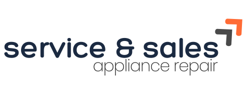

- **File type:** SVG
- **Usage:** The logo is lightweight, scalable, and responsive to ensure clarity on all devices and screen sizes
- **Placement:** Positioned in the navbar to support brand identity without overwhelming content
- **Sizing:** Controlled using CSS to maintain aspect ratio and fit within the navbar layout:

CSS

```.logo {height: 4.4em; width: auto;}```

## Website Structure & Accessibility
The **Service & Sales Appliance Repair** website is built with semantic HTML for clear structure and accessibility. 

The website consists of 4 main pages and a section link:

- **Home (Landing Page):** Introduces the business, highlights key services, and features a strong call-to-action.
- **About Us (Section link):** Shares company background and commitment to customers.
- **Our Services (Service Listing Page):** Details the appliance repair services offered, with clear categories (e.g. fridge, washing machine, oven repairs).
- **Contact Us (Form):** Provides a contact form for easy customer enquiries. 
- **Submission Confirmation (Acknowledgement Page):** Confirms that the user's form submission was successful, thanks them, offers next steps, and a link back home.

Key features include:

- **Semantic tags:** `<header>`, `<nav>`, `<main>`, `<section>`, and `<footer>` for logical page structure.
- **Navigation:** Simple, consistent, with clear link text for easy use with screen readers. 
- **Forms:** All inputs have linked `<labels>` elements, correct types (e.g. email), and logical tab order. 
- **Images:** Informative images have meaningful `alt` text.
- **Colour & Contrast:** Meets WCAG AA standards for readability.
- **Responsive text:** Use relative units (rem, em, & %) to support scaling and zoom.
- **Keyboard:** Visible focus states on links and buttons.

Accessibility is part of the design, not an add-on.

## Wireframes
The wireframes represent the core pages of the appliance repair website, designed to work across larger devices **>769px**, tablet **<768px**, and mobile **<478px** devices. They ensure quick access to booking, contact, and service information. 

<details>
<summary>Home Page</summary>
Features appliance categories, reviews, and contact info. Mobile devices are optimised for thumb-friendly navigation with quick access to contacts.


</details>

<details>
<summary>Our Services Page</summary>
Lists individual services (e.g. oven repairs) with descriptions and images, plus a "Contact Us" button. Mobile layout stacks sevice info for easy scrolling.

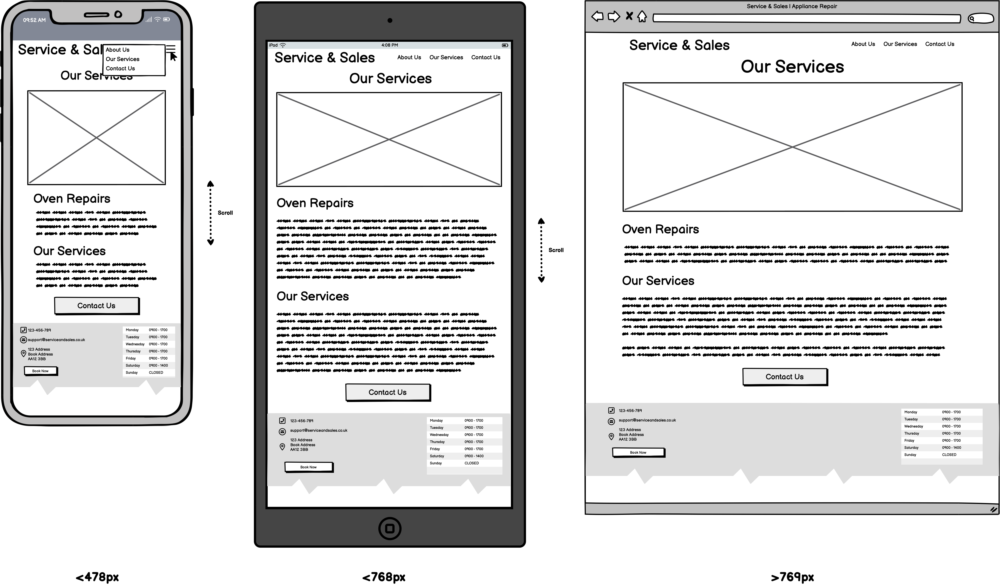
</details>

<details>
<summary>Contact Us Page</summary>
Simple form with name, email, and message fields, plus a clear "Send" button.


</details>

<details>
<summary>Action Page</summary>
Acknowledges the submission of the form, plus a clear "Return Home" button.

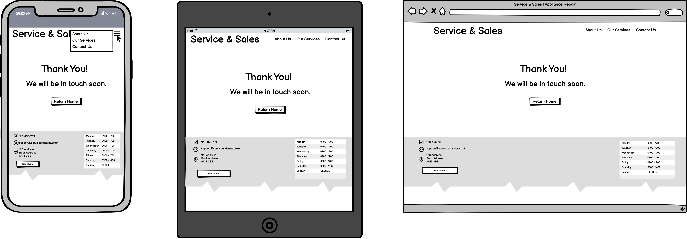
</details>

---

# Features

## Existing Features

<details>
<summary>Logo & Navigation</summary>

- Clear **Service & Sales logo** on every page.
- Consistent **navigation bar** with links to *Home*, *About Us*, *Our Services*, *Contact Us*.
- **Fully responsive** - transforms into a hamburger toggler on smaller screens.
- The **active page link is highlighted** so users can easily see where they are.
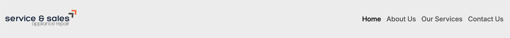
</details>

<details>
<summary>Hero Image & Button</summary>

- Large, engaging **hero image** on the home page.
- Prominent **call now button** encourages quick contact.
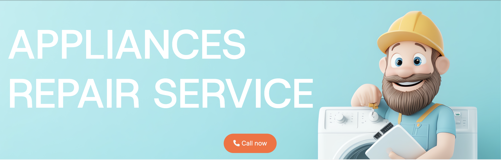
</details>

<details>
<summary>Appliances Section & Our Services Link</summary>

- Key appliance icons (e.g. oven, fridge, dishwasher, laundry) displayed on the home page.
- Directs users to the **Our Services** page for more details.
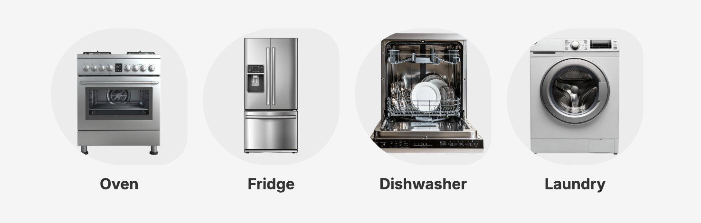
</details>

<details>
<summary>Carousel for Customer Reviews</summary>

- A **testimonial slider** displays customer feedback.
- Includes **carousel indicators** to allow users to easily navigate between reviews.
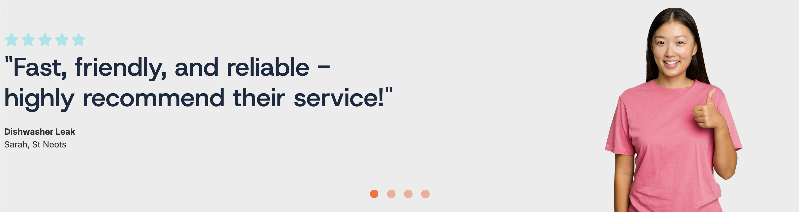
</details>

<details>
<summary>About Us Section (Home Page)</summary>

- Introduces the team and company values to build trust.

</details>

<details>
<summary>Our Services & Why Choose Us</summary>

- Details repair services offered for different appliances.
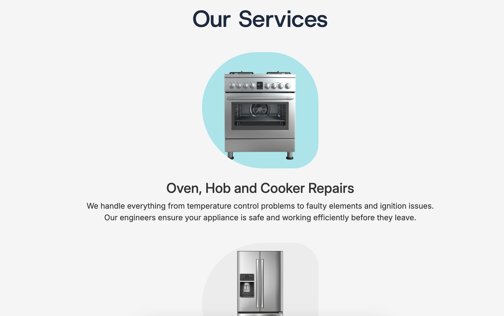

- Includes a **Why Choose Us** section highlighting key benefits (e.g. local engineers, transparent pricing).
- Features a **Contact Us Now Button** for easy booking.

</details>

<details>
<summary>Contact Us Form</summary>

- Form captures name, email, phone number, appliance type, message, and preferred appointment date if required.
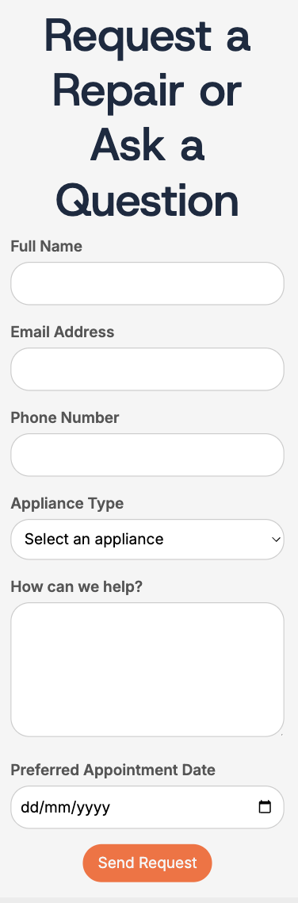
</details>

<details>
<summary>Thank You Page</summary>

- Confirms form submission with a friendly thank you message. 
- Includes a **Back to Home button**.
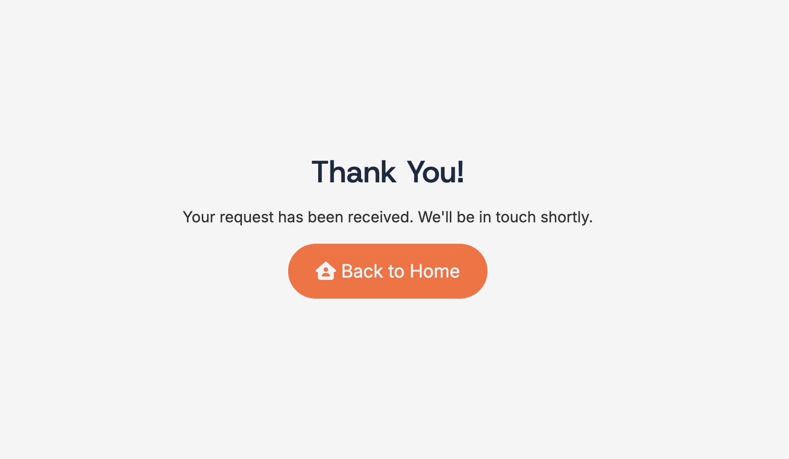
</details>

<details>
<summary>Footer & Call to Action</summary>

- **Footer appears on all pages**, containing contact details, opening times, and a repeated **call-to-action button**.
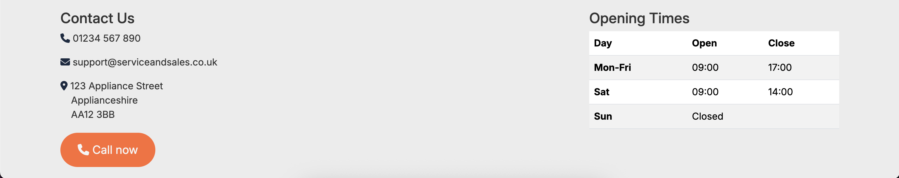
</details>

## Future Enhancements

Planned improvements have been tracked and prioritised using **GitHub Projects**, helping to manage progress and link user stories to development work.

[*GitHub Projects board managing tasks and priorities.*](assets/readme-references/screenshots/git-projects.png)

### Integrate External Customer Review Link

#### User Story:
As a customer, I want to leave a review easily via a trusted platform (e.g. Trustpilot), so I can share my experience and help others decide.
[Screenshot from *GitHub Projects*](assets/readme-references/screenshots/review-task.png)

#### Enhancement:
Add a visible, accessible button or link on the home page and contact page that directs customers to a trusted external review site (such as Trustpilot or Google Reviews).

### Show Pricing / Quote Process

#### User Story:
As a customer, I want to see clear pricing or understand how to request a quote, so I know what to expect before booking.

#### Enhancement:
Include a dedicated section or page explaining how quotes are provided, or list example pricing for common repairs.

### Add Online Booking

#### User Story:
As a customer, I want to book a repair appointment online, so I can confirm a date and time without having to call.

#### Enhancement:
Build a basic booking form or integrate a simple calendar tool to accept appointments.

### Educational Content Page

#### User Story:
As a customer, I want tips and advice about appliance care, so I can maintain my appliances and prevent breakdowns.

#### Enhancement:
Add a page with articles or FAQs about appliance care, common faults, and prevention tips.

---

# Technologies Used

## Languages
- HTML5
- CSS3

## Frameworks, Libraries & Programs Used
- [Bootstrap v5.3](https://getbootstrap.com/)
    - Used to ensure responsiveness and provide styling across the website.
- [Google Fonts](https://fonts.google.com/)
    - The 'Host Grotesk', 'Source Code Pro', and 'Inter' fonts were imported into the `style.css` file and used throughout the site.
- [Font Awesome](https://fontawesome.com/)
    - Included on all pages to provide icons that enhanced aesthetics and improve user experience.
- [jQuery](https://getbootstrap.com/docs/5.3/getting-started/download/)
    - Bundled with Bootstrap to make the navbar, carousel, and buttons responsive and enable smooth scroll functionality.
- [VS Code](https://code.visualstudio.com/)
    - Visual Studio Code was used as the main code editor for writing and managing the project's HTML, CSS, and other files.
- [Balsamiq Wireframes](https://balsamiq.com/?gad_source=1&gad_campaignid=203404003&gbraid=0AAAAAD3BuzO1_MfAH220pB2sjY8-SH4XY&gclid=Cj0KCQjwvajDBhCNARIsAEE29WqRr6MNJNBlZ2P9yCYgdpEVjwPQac8uQL0IlC2WZUqABjTq6pGe_eQaAismEALw_wcB)
    - Used to create wireframes during the design phase.
- [Git](https://git-scm.com/)
    - Used for version control, with commits made via Gitpod terminal.
- [GitHub](https://github.com/)
    - Hosted the projects code after being pushed from Git. GitHub Projects was used to manage tasks, track progress, and organise workflow during development.
- [Adobe Stock](https://stock.adobe.com/uk/)
    - Provided high-quality visuals and images used across the site.
- [Canva](https://www.canva.com/)
    - Used to design the company logo.
- [Coolors](https://coolors.co/)
    - Used for generating the colour palette and initally review colour contrast for accessibility.
- [Google Developer Tools](https://developer.chrome.com/docs/devtools)
    - Used to test and debug the site across different screen sizes, devices, and browsers to ensure responsiveness and performance.

---

# Testing

---

# Deployment 
Deployed via GitHub Pages: <!-- include deployed page -->

---

# Credits

## Content

## Media
- [Coolors](https://coolors.co/1b2a41-4a4a4a-ff6b35-f5f5f5-333333) - Color scheme generator for styling
- [Google Fonts](https://fonts.google.com/) - For typography imports
- [Free Icons](https://freeicons.io/profile/75801) - For Favicon credit to designer Hilmy Abiyyu Asad, contributor to free source
- [Canva](https://www.canva.com/) - Used to design business logo and generate SVG file for navbar

## Code

- [Google Fonts](https://fonts.google.com/) - Embed CSS code for typography

## Acknowledgement
- [Code Institute](https://codeinstitute.net/global/) - Learning Platform
- [WCAG 2.1](https://www.w3.org/TR/WCAG21) and [Coolors Color Contrast Checker](https://coolors.co/contrast-checker) - Accessibility contrast checker to support and maintain readability
- [WCAG 2..2 Techniques](https://www.w3.org/WAI/WCAG22/Techniques/css/C22) and [WebAim - Typefaces and Fonts](https://webaim.org/techniques/fonts/) - Accessibility typeface and fonts support and maintain readability
<!-- include any CSS frameworks, resource for images, etc) -->

