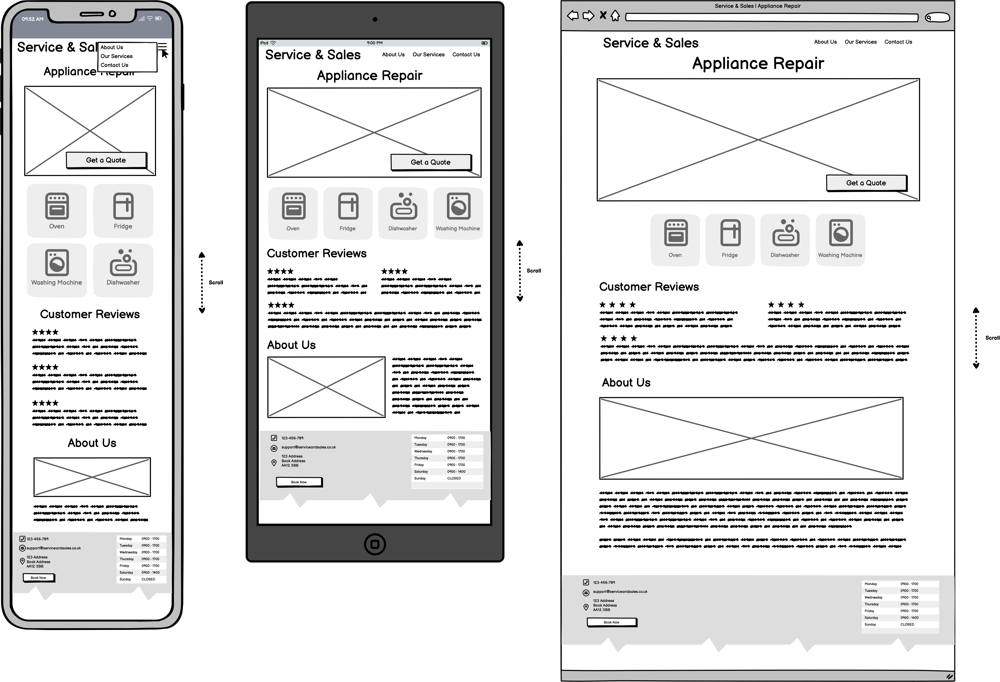
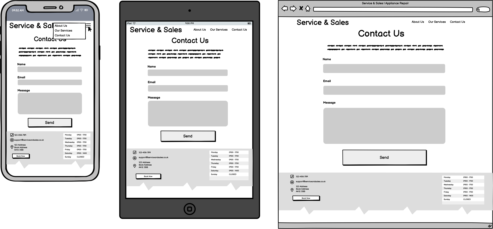

# Service & Sales Appliance Repair

A clean, modern website for a local appliance repair company specialising in fridge, freezer, washing machine, and oven repairs. Built using **HTML5** and **CSS3**.

<!-- Replace with your screenshot image and path for resposive mock-up] -->

---

## Table of Contents
1. [UX](#ux)
    * [Project Overview](#project-overview)
    * [Developer and Business Goals](#developer-and-business-goals)
    * [User Stories](#user-stories)
    * [Design Choices](#design-choices)
    * [Wireframes](#wireframes)
2. [Features](#features)
    * [Existing Features](#existing-features)
    * [Future Enhancements](#future-enhancements)
3. [Technologies Used](#technologies-used)
4. [Testing](#testing)
5. [Deployement](#deployment)
6. [Credits](#credits)
    * [Content](#content)
    * [Media](#media)
    * [Code](#code)
    * [Acknowledgement](#acknowledgement)


---

# UX

## Project Overview
This website provides users with an easy way to: 
- Learn about appliance repair services
- Contact the business for quotes or bookings
- Find information on common appliance issues

It's designed to be clear, responsive, and user-friendly for all vistors. 

## Developer and Business Goals
- Increase visitor-to-customer conversion by reducing friction in booking and contact
- Build trust through social proof (reviews, photos, videos)
- Encourage quick action with easy contact options
- Strengthen local precesence via targeted, helpful contact

## User Stories
As a **potential customer**, I want to:

1. Quickly see what types of appliances you repair so that I can feel confident your services meets my needs
    * ✅ The home page clearly list major apliance types *(e.g. ovens, fridges, washing machines, dishwashers)*
    * ✅ There's a dedicated **Our Services** page with further detail
    * ✅ Appliance types appear within the first screen on desktop and mobile *(no scrolling required)*
2. See clear pricing or how to get a quote, so that I can make a decision without needing to call first
    * ✅ There is a **Pricing** or **Get a Quote** button visable on the home page
    * ✅ Clicking this takes the user to a form or price guide with estimated costs or a simple quote request form
    * ✅ The form can be completed in under 2 minutes
4. Be able to easily book a repair visit online, so that I don't have to wait to speak to someone
    * ✅ The website has a **Book Now** button on all main pages
    * ✅ Booking form allows selection of appliance type, issue, date, and contact details
    * ✅ Customer recieves an email or SMS confirmation after booking
6. See positive reviews or testimonials from real customers, so I feel reassured about the quality of your serivce
    * ✅ At least 3 customer reviews are visable on the home page
    * ✅ Reviews are real *(from Google, Trustpilot or direct customers)*
    * ✅ There's a link to view more reviews
8. See photos of your work or your team, so I can trust that you're professional and realiable
    * ✅ The home page features at least 1 image of the team or repair work
    * ✅ There is a gallery or **About Us** page with photos that look professional and friendly

As a **customer**, with an urgent repair: 

1. See contact details immediately so that I can reach you fast
    * ✅ A clickable phone number is in the site header and footer
    * ✅ Contact options *(phone, WhatsApp, email)* are visable on the home page without scrolling

As a **returning customer** I want to:

1. Quickly find your contact page or booking form, so I can request another repair without fuss
    * ✅ Contact/ booking links are always visible in the main menu
    * ✅ Returning users can book or contact in under 3 clicks/ taps

As a **mobile user** I want your: 

1. Website to load fast and work well on my phone, so I can use it easily when I'm on the go
    * ✅ All key buttons *(book, contact)* are finger-friendly and easy to tap
    * ✅ Content is readable without zooming on small screens

As a **local resident** I want to: 

1. See comments and reviews about common appliance faults and fixes, so I can recognise when I need a repair
2. See social media posts about common appliance faults and fixes, so I can recognise when I need a repair
    * ✅ At least 1 educational/ helpful post per week about appliance faults/ tips
    * ✅ Posts are written in plain language, not technical jargon
  
As a **busy homeowner** I want to: 

1. See your opening hours, service area, and services at a glance, so I know you cover my location and needs
    * ✅ Website list opening hours, main appliance types, and service area *(e.g. **Serving Herts & North London**)*

## Design Choices

### Colour Scheme

The following [colour palette](assets/colour-scheme/colour-scheme.png) is generated via [Coolors](https://coolors.co/1b2a41-4a4a4a-ff6b35-f5f5f5-333333):

- **Primary:** Oxford Blue `#1B2A41`
- **Secondary:** Davy's Gray `#4A4A4A`
- **Accent:** Orange (Crayola) `#FF6B35`
- **Background:** White Smoke `#F5F5F5`
- **Body Text:** Jet `#333333`

These colours have been chosen to convey trust, clarity, and a clean modern look suitable for an appliance repair business.

#### Accessibility Contrast

The colour palette has been chosen with the aim to meet [WCAG 2.1](https://www.w3.org/TR/WCAG21) AA contrast requirements for readability and accessibility:

- **Primary #1B2A41** on **light backgrounds #F5F5F5** provides strong constrast for headings and key UI elements (12.2:1 contrast ratio / AAA WCAG)
- **Body text #333333** on **light backgroudns #F5F5F5** meets recommended contrast for standard text (15.2:1 contract ratio / AAA WCAG)
- **Accent #FF6B35** is used for buttons and calls to action, always paired with sufficient contrast (e.g. white on orange buttons)
- Small orange text on light backgrounds will be avoided to maintain readability

*All colours have been checked against [Coolors Color Contrast Checker](https://coolors.co/contrast-checker).*

⚠️ If you customise this palette, please check that new combinations maintain sufficient colour contrast for users with visual impairments. 

### Typograhpy
The following typography is loaded from [Google Fonts](https://fonts.google.com/):
- **Primary font:** [Host Grotesk (Medium 500)](https://fonts.google.com/specimen/Host+Grotesk) - used for headings and key UI text
- **Secondary font:** [Source Code Pro](https://fonts.google.com/specimen/Source+Code+Pro) - used for snippets and technical elements
- **Body:** [Inter](https://fonts.google.com/specimen/Inter?query=inter) - used for paragraphs and general content

#### Google Fonts Link
CSS

```<style>```
```@import url('https://fonts.googleapis.com/css2?family=Host+Grotesk:ital,wght@0,500;1,500&family=Inter:ital,opsz,wght@0,14..32,100..900;1,14..32,100..900&family=Source+Code+Pro:ital,wght@0,200..900;1,200..900&display=swap');```
```</style>```

#### Accessibility Typography

The fonts have been chosen with readability and accessibility in mind:

- Provide sufficient letter spacing and clear distinction between characters
- Avoid decorative fonts or excessive stylisation that could impair readability
- Pair with strong colour contrast to support users with low vision or dyslexia

Where possible:

- **Responsive sizing** so text remains readable on all devices
- **Scable units (e.g. rem/em)** so users can resize text in their browser without breaking layout

*Further accessibility best practises are considered in styling and layout to ensure inclusive design.*

### Imagery

## Wireframes
The wireframes represent the core pages of the appliance repair website, designed to work across larger devices **>769px**, tablet **<768px**, and mobile **<478px** devices. They ensure quick access to booking, contact, and service information. 

### Home Page
Features appliance categories, booking button, reviews, and contact info. Mobile devices are optimised for thumb-friendly navigation with quick access to booking and contacts.



### Our Services Page
Lists individual services (e.g. oven repairs) with descriptions and images, plus a "Contact Us" button. Mobile layout stacks sevice info for easy scrolling.


### Contact Us Page
Simple form with name, email, and message fields, plus a clear "Send" button.



---

# Features

## Existing Features
- Clean, mobile-friendly design
- Services section (fridge repair, washing machine repai, etc)
- Testimonials / review section
- Hero banner with business info and call to action

## Future Enhancements
- Add a booking system with calendar
- Include a blog or tips section
- Admin login for managing services and pricing

---

# Technologies Used
- HTML5
- CSS3
- Google Fonts
- Font Awesome
- Balsamiq Wireframes

---

# Testing

---

# Deployment 
Deployed via GitHub Pages: <!-- include deployed page -->

---

# Credits

## Content

- [Coolors](https://coolors.co/1b2a41-4a4a4a-ff6b35-f5f5f5-333333) - Color scheme generator for styling
- [Google Fonts](https://fonts.google.com/) - For typography imports

## Media

## Code

- [Google Fonts](https://fonts.google.com/) - Embed CSS code for typography

## Acknowledgement
- [Code Institute](https://codeinstitute.net/global/) - Learning Platform
- [WCAG 2.1](https://www.w3.org/TR/WCAG21) and [Coolors Color Contrast Checker](https://coolors.co/contrast-checker) - Accessibility contrast checker to support and maintain readability
- [WCAG 2..2 Techniques](https://www.w3.org/WAI/WCAG22/Techniques/css/C22) and [WebAim - Typefaces and Fonts](https://webaim.org/techniques/fonts/) - Accessibility typeface and fonts support and maintain readability
<!-- include any CSS frameworks, resource for images, etc) -->

